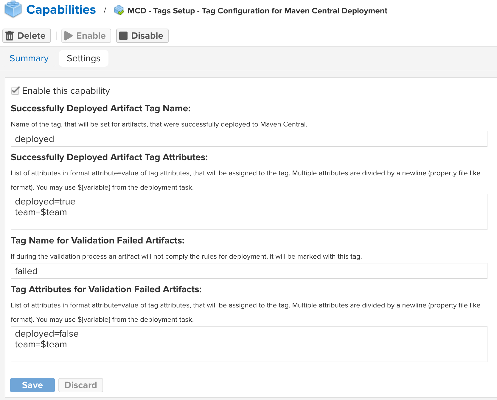
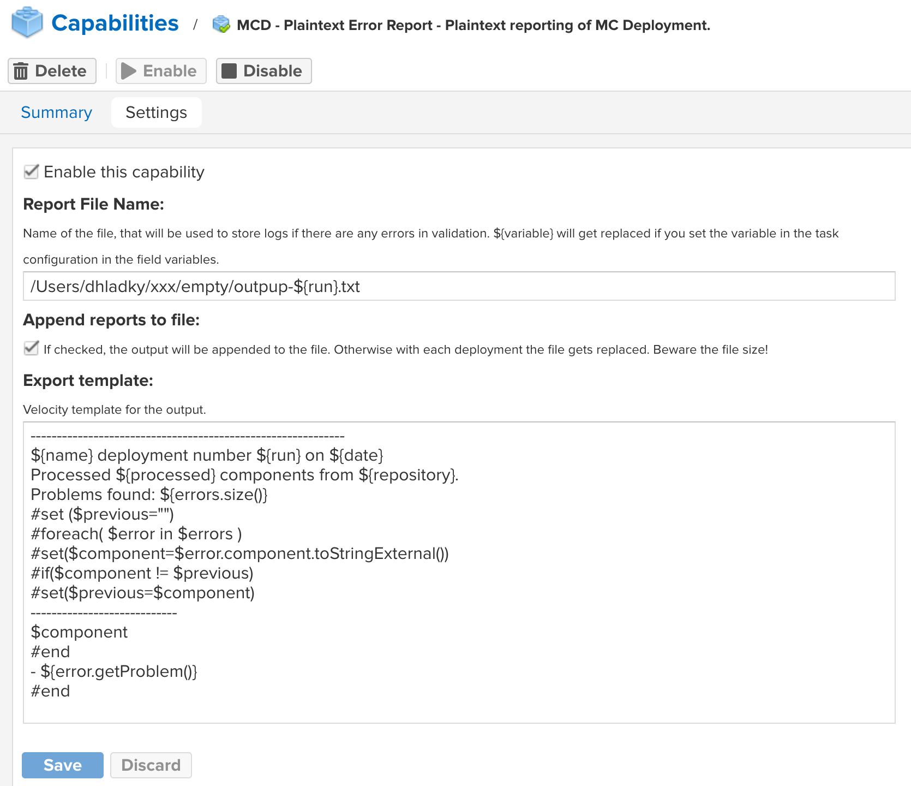
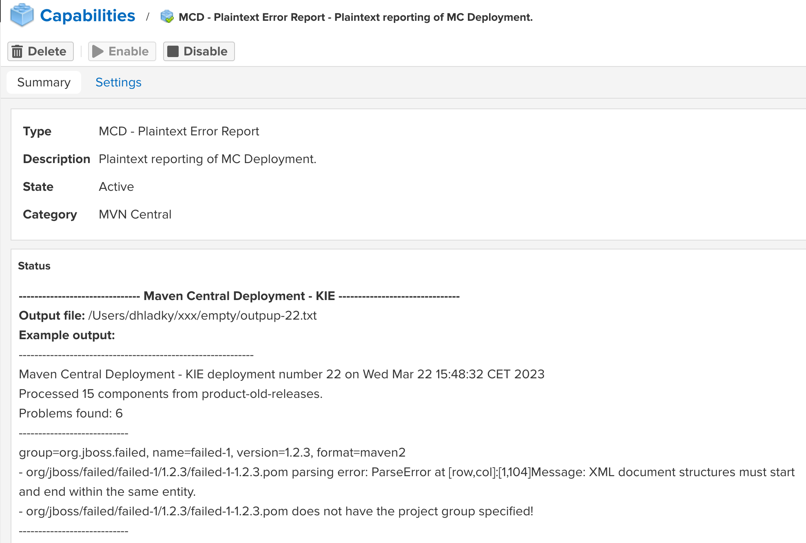

# nx3-maven-central-deploy
is a plugin for deployment of artifacts from Sonatype Nexus 3 repositories to [Maven Central](https://central.sonatype.com). If you use NXRM3 Professional, you can combine the deployment with **tagging** and **staging**.

The advantage of using this plugin instead of directly deploying artifacts with Maven is the ability to test your artifact before pushing to Central - your developer may deploy his work to your NXRM3 repository, QA can test the release and if everything is OK, this plugin will transfer the tested bits exactly as they were tested. Running the Maven command to build and deploy from the same source code to Central usually does not result in the same binaries (timestamps do not match) and there is also a room for some human error if you recompile your code.

Nx3-maven-central-deploy also makes sure, that before you try to push your artifacts into Maven Central, you fulfill the [requirements](https://central.sonatype.org/publish/requirements/) Sonatype has for the published content. You can even extend the checking features by adding your own validation rules. You are not required to use any CI/CD pipelines such as Jenkins, though you still can if you want to.

# Features

Nx3-maven-central-deploy is currently in very early stage of development so most of the "must have features" are not yet completed. See the roadmap.

These features will appear in the first release version:
* push released artifacts into Maven Central
* filter components in the repository to be selected for the deployment
* validate the artifacts before pushing them to Maven Central
* combine your validation with nx3-maven-central-deploy pre-prepared tests by adding simple custom modules
* tag artifacts successfully deployed to Maven Central (NXRM3Pro only)
* tag artifacts where errors were found making them not suitable for publishing (NXRM3Pro only)
* report validation errors in customizable text file format
* report validation errors using NXRM3 logging environment
* integrate validation reporting with Jira
* allow adding your own integrations with other bug reporting tools by adding custom modules

# Compatibility

At the current state of development the plugin works with Sonatype Nexus version 3 Professional. I plan to make it work with the community version later, but it will not support NXRM3 Professional features, such as tagging artifacts. The current build is working with NXRM3 version 3.42.0-01, later it will follow Nexus public releases. 

# Roadmap

The features here are ordered based on the current development priority - the top ones should be finished first, although in some cases they are being worked on simultaneously.  

## Completed
- filter components in the repository to be selected for the deployment
- validate artifacts before pushing them to Maven Central
- tag artifacts successfully deployed to Maven Central
- tag artifacts, where errors were found making them not suitable for publishing
- report validation errors in customizable text file format

## In Development
- integrate validation reporting with Jira

## Coming Soon
- push released artifacts into Maven Central
- combine your validation with nx3-maven-central-deploy pre-prepared tests by adding simple custom modules
  - example validation plugin
- report validation errors using NXRM3 logging environment
- allow adding your own integrations with other bug reporting tools by adding custom modules
  - example reporting plugin

# Installation

You will find the installation packages of the current versions of Nexus in [GitHub releases](https://github.com/jbossorg/nx3-maven-central-deploy/releases).

Download the version suitable for your version of Nexus and copy it to the *{nexusInstallDir}/deploy/*. When doing Nexus upgrade, you must also upgrade nx3-maven-central-deploy, so it runs the same version number as your Nexus. 

Unless you already have it, enable **Schedule** capability under *System->Capabilities* in Nexus.

# Capabilities and Tasks in Detail

## Deployment Task

In order to use nx3-maven-central-deploy, you must have **Schedule** capability enabled. The deployments are scheduled as tasks under *System-->Tasks* tab.    

Go to *System-->Tasks* tab and click on *+ Create Task* button. It will open list of possible tasks you can create and if you installed nx3-maven-central-deploy properly, you will be able to find **Maven Central Deployment**.

Mandatory field is **name of the task**, make sure to find a good name, because the name will appear in reports. Then you must select **source repositories** - only hosted release repositories are allowed. The other repositories do not appear here. The last mandatory field is **Task frequency**. 

When preparing a synchronization task for your project, that is already in Maven Central you need to prepare your task, so it does not try to re-publish artifacts, that were already published in the past, so set it to "Manual". We will cover this case later. 

If you are trying to prepare deployment of a project, that is not in Maven Central yet, select some reasonable period here, that is not too long, otherwise you will need to wait for the artifacts to appear in Maven Central for too long, but also do not set it to a too short interval, otherwise you may be spammed by failing reports. Reasonable time is IMO once a day, but it is up to you.        

| Field                | Explanation                                                                                                                                                                                                                                                                                                                                                                                                                                                                                                                                                                                                 |
|----------------------|-------------------------------------------------------------------------------------------------------------------------------------------------------------------------------------------------------------------------------------------------------------------------------------------------------------------------------------------------------------------------------------------------------------------------------------------------------------------------------------------------------------------------------------------------------------------------------------------------------------|
| Dry-Run              | If checked, the task will do the validations, but it will not try to publish the artifacts into Maven Central. It is useful in initial testing of your project or when setting up the task.                                                                                                                                                                                                                                                                                                                                                                                                                 |
| Mark Completed       | Use this field with Dry-Run checked before you do your first push to Maven Central if you already published your artifacts there.  If checked, after the successful validation of your artifacts the task will mark the validated artifacts as published and next time this task will run the marked artifacts will be ignored by the task.  If you have Dry-Run checkbox unchecked also, the task will only mark the artifacts as deployed if the actual deployment succeeds (aka a network failure during push will prevent marking the artifacts deployed even though the validation succeeded). |
| Filter               | This field allows you to limit the deployment of artifacts to a specific subset of artifacts. The syntax of the filter is explained later.                                                                                                                                                                                                                                                                                                                                                                                                                                                                  |
| Task Variables       | nx3-maven-central-deploy uses Velocity templating technology in many places, especially during the reporting of the errors. Here you can set your own variables to be added to the template processing by this  task. Example is the name of Jira project, that should be used to report validation failures to.  The syntax is {variable}={value} delimited by a newline character (a standard property file without sections).                                                                                                                                                                    |

While most of the [requirements](https://central.sonatype.org/publish/requirements/) are mandatory, you might have a reason for disabling some of them. For example even though the JavaDoc is mandatory you have it deployed elsewhere. Or you just want to make the initial "mark all artifacts as published using Dry-Run" even though your old artifacts do not comply with the Sonatype requirements.

| Check               | Descritpion                                                                                                                                                                                                                                           |
|---------------------|-------------------------------------------------------------------------------------------------------------------------------------------------------------------------------------------------------------------------------------------------------|
| Project Name        | Ensures you have the name of the project in your pom.xml.                                                                                                                                                                                             |
| Project Description | Ensures you have the description of your project in pom.xml.                                                                                                                                                                                          |
| URL                 | Your pom.xml should have the URL with link to your project web page.                                                                                                                                                                                  |
| SCM                 | SCM stands for "source code management". Now it will be most likely a git repository, SVN or similar.                                                                                                                                                 |
| Developer Info      | Information about the developer of the plugin (author, company).                                                                                                                                                                                      |
| License             | Your project must be open-source if you deploy it to MVN Central. You must say under what conditions it can be used.                                                                                                                                  |
| Snapshot Version    | Snapshot versions are not allowed in Maven Central. This validation also makes sure you did not forget a snapshot version in one of the dependencies. The check only validates your pom.xml, it does not check the dependencies of your dependencies. |
| Source Code         | Maven allows downloading source code of your dependencies during the development. [See here](https://maven.apache.org/plugins/maven-source-plugin/).                                                                                                  |
| JavaDoc             | JavaDoc file is also required when you publish to Maven Central. More information [see here](https://maven.apache.org/plugins/maven-javadoc-plugin/).                                                                                                 |
| MD5 Checksums       | The artifacts should have checksum files so Maven can validate the downloaded files during build. md5 and sha1 are a must in Maven Central. sha256, sha512 and asc (GPG) are welcome but not required.                                                |
| SHA1 Checksums      | See MD5 Checksums                                                                                                                                                                                                                                     |
| Project             | Your pom.xml must have project as the root element. If not, something is very wrong with your pom.xml file. Probably some error in your CI/CD pipeline damaged the file. Maven itself would refuse to build your project.                             |
| Group               | Maven uses group, artifact and version to identify your artifact. The group is mandatory, however it can be skipped if Maven can take it from parent.                                                                                                 |
| Artifact            | Maven uses group, artifact and version to identify your artifact. The artifact name is mandatory and your artifact must have it.                                                                                                                      |
| Version             | Maven uses group, artifact and version to identify your artifact. Version is mandatory, however it can be skipped if Maven can take it from parent.                                                                                                   |

### Filtering Artifacts
You may have a big repository with released content and want to deploy only part of it to Maven Central. Or you want to split your deployment to several smaller deployments, so that possible validation errors are reported in Jira projects of the specific responsible teams. Whatever is your intention **Filter** field in the task configuration is your friend. 

You can filter by group, artifact, version, tag name and tag attribute. You can also search without specifying the search field, and in that case the plugin will search for artifacts, that have this text in group, artifact or version. 

| Field    | Operators       | Example             | Description                                                                                                                                                                |
|----------|-----------------|---------------------|----------------------------------------------------------------------------------------------------------------------------------------------------------------------------|
| {none}   | {none}          | kie-api             | Searches for kie-api in fields group, artifact and version                                                                                                                 |
| group    | =               | group=org.jboss.as  | Searches for artifacts with org.jboss.as group                                                                                                                             |
| artifact | =               | artifact=kie-api    | Searches for artifact named kie-api                                                                                                                                        |
| name     | =               | name=kie-api        | Nexus uses "name" instead of "artifact" in the classes due to the support of other than Maven repository types. This expression has identical effect to *artifact=kie-api* |
| version  | = < > <= >= !=  | version>4.5.0       | Check, if version is equal, less than, smaller then etc. than the expression. The version is compared by string comparison, so version 10.0 is smaller than 4.0.           |
| tag      | = < > <= >= !=  | tag!=Deployed       | Check if one tags assigned to an artifact corresponds to the operation. In this example tag must not be *Deployed*. You can only use this feature in NXRM3 Professional.   |
| tagAttr  | = < > <= >= !=  | tagAttr=os!=Windows | Tags in Nexus may have attributes. In this case search for any tag. If it has attribute *os* with value not equal to *Windows* the artifact would be a match. You can check multiple tag attributes at once. If the artifact has several tags, at least one of them must comply with each tagAttr condition and it is not mandatory the condition is matched on the same tag.            |

You can combine several of these tests together and divide them by & character (in that case all these conditions must be fulfilled). Each condition can only be used once, with the exception of tag attribute. 

**Example:** *group=org.jboss.as&version>=7.4.0* returns all artifacts with group org.jboss.as with version 7.4.0 and higher.

*group=org.jboss.as&group=org.hibernate* will fail, because group can only be present once in the filter.

*tagAttr=deployed=false&tagAttr=os=Windows* returns all artifacts, that have a tag with the attribute *deployed* with the value *false*, and they also have a tag with the attribute *os* with value *Windows*. The condition can be fulfilled by a single tag with both attributes or by two tags, that each define one of the values.  

## Tag Setup Capability
In order to help to navigate in the synchronized repository, nx3-maven-central-deploy can be customized to tag the deployed artifacts. In order to fight bugs it is also possible to configure it to mark artifacts, that do not pass the validation.

You can find this feature in capabilities. The feature only works if you are using NXRM3 Professional, because the community version does not support tagging. Both tag names and tag attributes are parsed by Velocity and possible variables from your configuration will be applied to them. On the picture you can see the variable *team* was used. 

It is not possible to only use tag attributes (they are always associated with some tag). Do note, that if you use a simple tag name, and you change the attributes of this tag, the change applies to the actual tag, so it will have the impact  on the artifacts already associated with this tag from earlier releases. So if you want to rely on tag attributes, use some variable, that will make the tag name unique with each deployment, such as $run (the number of the current deployment) or $date. 

So in the example from the picture the right approach would be tag name *deployed-$run* instead of simple *deployed*. The deployed artifacts will be marked by a tag with name *deployed-456* in 456th run of the task. If you use multiple deployments, and you want this behaviour, make sure the tag names do not overlap. Each deployment configuration uses its own deployment counter.

## Plain-text Reporting Capability
Nx3-maven-central-deploy allows troubleshooting artifacts, that do not comply with the Maven Central requirements. You can find this feature in *System->Capabilities*. If you configure this feature, nx3-maven-central-deploy report any failed checks to a plaintext file.    

You must fill the target file name, and you must provide the Velocity template, that will be used to render the output. The template on the picture is a default one, but you can go wild in customizing it. The file name is also being parsed by Velocity, so you can use variables from your task configuration to create unique file names for each deployment. 

When you save the configuration and switch tab to Summary, you will get an overview of what will your output look like.

In the summary the plugin searches for all your deployment configurations, applies fictive validation failures using your template and displays them in the Status window. On the picture you can see one of my deployments has a task name "Maven Central Deployment - KIE". And if the plugin would find some validation errors, they would be rendered like that using my current template. If you scroll down you would find other configuration renderings. It is useful to check here that you have defined all the variables in all your configurations. 

The plaintext report is the simplest of the reports. Do note, that it does not allow log rotation or similar. If you have many errors and you spam the task, be sure you have enough room on your target disk. 

## Jira Reporting Capability
 ! TODO

## Logging Reporting Capability
 ! TODO

## Using Velocity in nx3-maven-central-deploy
Nexus uses Velocity templating in many places and this plugin uses it, so you can customize your reports and other features. To learn basics of templating using Velocity I suggest you check the Apache project's [getting started](https://velocity.apache.org/engine/2.3/getting-started.html) webpage.   

### Velocity Variables

You can use variables in form of $variable or ${variable}. If an object is more complex type, you can use "." to access its properties, such as $error.problem. 

#### Common Variables
Common variables will be present in all reporting capabilities. On top of these you will be able to use the variables you defined in the deployment configuration.

| Variable | Description                                                                                 |
|----------|---------------------------------------------------------------------------------------------|
| date     | The current date at the start of the report.                                                |
| name     | Name of the deployment task.                                                                |
| run      | The number of the current deployment. Each deployment attempt increases this number by one. |

In the reports you will work with FailedCheck object, that holds information about single verification failure.  
##### FailedCheck Object Structure
| Property  | Type      | Description                                    |
|-----------|-----------|------------------------------------------------|
| component | Component | The identification of artifact with an error   |
| problem   | String    | The human readable description of the problem. |

##### Component Object Structure
| Property/          | Type   | Description                                                                      |
|--------------------|--------|----------------------------------------------------------------------------------|
| format             | String | In this plugin you will always work with maven2 artifacts.                       |
| name               | String | Name of the artifact. It corresponds to the artifact coordinate in pom.xml file. |
| group              | String | Group name of the artifact.                                                      |
| version            | String | Version of the artifact.                                                         |
| toStringExternal() | String | This useful method combines the artifact coordinates into a single String.       |

#### Plaintext Report Variables
| Variable   | Description                                                             |
|------------|-------------------------------------------------------------------------|
| errors     | Array of *FailedCheck* objects ordered by component.                    |
| processed  | The total number of artifacts, that were checked during the deployment. |
| repository | Nexus repository name.                                                  |

# Extending nx3-maven-central-deploy by Your Tests and Reports
nx3-maven-central-deploy was designed with the emphasis of the possibility to enhance checking and reporting capability. If you want to implement **your own validation(s)**, you can create a plugin, that extends **org.jboss.nexus.validation.checks.CentralValidation** class. In order to add your own **reaction** on a failed deployment, implement a capability, that extends **org.jboss.nexus.validation.reporting.TestReportCapability**.  

In both cases nx3-maven-central-deploy will use the dependency injection to add your capability to the process of validation or error reporting based on the parent class you extended. You do not need to worry about registering it or similar. An example plugins will be added later, so you would be able to easily extend the test/reporting contract with your own logic. 

If you need to read the configuration of other nx3-maven-central-deploy extension capabilities, you can use [org.jboss.nexus.MavenCentrayDeploy::findConfigurationForPlugin(configurationClass)](src/main/java/org/jboss/nexus/MavenCentralDeploy.java) method. Based on configuration class it will try to find registered configuration of this type. 

You can manually register your own capability configurations using [org.jboss.nexus.MavenCentrayDeploy::registerConfiguration(MavenCentralDeployCapabilityConfigurationParent configuration) ](src/main/java/org/jboss/nexus/MavenCentralDeploy.java), but all check and report plugins register or unregister automatically when you activate/deactivate your capability.